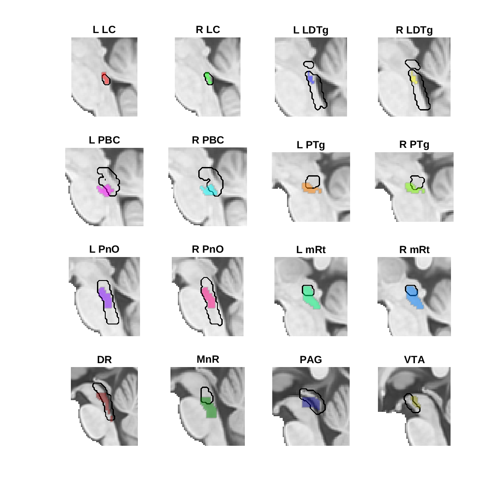
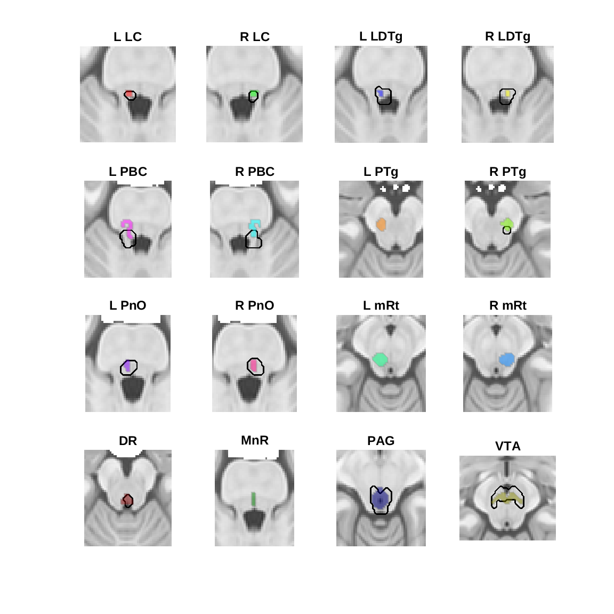

## Overview

This atlas is based on histology, immunochemistry and ex vivo DWI tractography 
in 3 postmortem individuals. The resulting parcels have been extensively 
characterized in terms of their cortical, subcoritcal and commisural 
structural connectivity, and functional connectivity with resting state 
functional connectivity, specifically the DMN (Edlow, 2023).

Although the measurement techniques are extensively documented (Edlow 2012, 
2023), technical details of the projection to MNI space are obscure.  The 
atlas is in MNI 1mm space but it's not clear what template was used to achieve 
this projection. Based on the publication date of the original atlas (v1.0), 
the use of FSL tools for tractography, and under the assumption that the same 
templates were used for the current atlas version (v2.0, a safe assumption: 
differences with version 1.0 are detailed here: 
https://datadryad.org/stash/dataset/doi:10.5061/dryad.zw3r228d2 and they are
minor as far as spatial characteristics are concerned), I've assumed they 
used the FSL standard 1mm template, which is MNI152NLin6Asym, and used the
subcortically weighted alignment from MNI152NLin6Asym to MNI152NLin2009cAsym
space in the templates/transforms folder to project it to MNI152NLin2009cAsym
space. That said, given the obscurities associated with the template selection 
the boundaries of these regions should be considered approximate.

Consider comparing regions with the Bianciardi brainstem nuclei. All of these
are also available there, albeit under a more restrictive distribution license.

## License

This dataset is licensed under creative commons (CC0) 1.0 Universal and is in
the public domain.

## Comparison with Bianciardi

The Bianciardi Brainstem atlas is a partially completed comprehensive atlas of
brainstem nuclei. It's based on multimodal imaging data without ex vivo 
validation, but is probablistic, based on more participants, and because it
tries to account for all brainstem nuclei it's less likely to mislabel regions
belonging to one nucleis that in fact belong to another. Unfortunately it has
a restrictive distribution license and is not suitable for all applications as
a result. The Harvard Ascending Activation Network atlas may be more suitable
in these circumstances or for use as a histological reference, however limited
its precision may be (due to small sample size and poor specificaiton of 
MNI space template used).

All AAN atlas regions have one more or more corresponding regions in 
Bianciardi's atlas.

AAN -> Bianciardi 
L_LC -> L_LC 
R_LC -> L_RC 
L_LDTg ->  L_LDTg_CGPn 
R_LDTg -> R_LDTg_CGPn 
L_PBC -> L_MPB, L_LPB 
R_PBC -> R_MPB, R_LPB 
L_PTg -> L_PTg 
R_PTg -> R_PTg 
L_PnO -> L_PnO_PnC_B5 
R_PnO -> R_PnO_PnC_B5 
L_mRt -> L_isRt (Also overlps Bianciardi's PTg; Note, Bianciardi also has R/L_mRta, R/L_mRtd and R/L_MRtl, but they're more rostral and don't overlap) 
R_mRt -> R_isRt (See note for L_mRt) 
DR -> DR_B7 
MnR -> MnR_B6_B8,PMnR_B6_B8 
PAG -> PAG 
VTA -> L_VTA_PBP, R_VTA_PBP 

In some cases bianciardi provides a finer grained parcellation. In other cases
the nuclei from the AAN Atlas are more limited in scope than their counterparts
from bianciardi. For instance LDTg in AAN is LDTg_CGPn in bianciard, presumably
because the LDTg and CGPn could not be distinguished based on the contrasts
available to Bianciardi. With this miscorrespondence of boundaries in mind, the
following comparison of atlas boundaries may be useful. Titles indicate AAN 
regions, also shown in color, with outlines of Bianciardi's equivalent regions
(possibly merged if there are multiple) overlain.

Saggital Brainstem Nuclei

Coronal Brainstem Nuclei

Axial Brainstem Nuclei

If attempting to adjudicate between these atlases it may be helpful to compare
individual nuclei with their corresponding PET tracer maps from Hansen et al. 
2022 as was done for Bianciardi's serotonergic nuclei (see Bianciardi atlas
README.md file)

## External Links

* https://datadryad.org/stash/dataset/doi:10.5061/dryad.zw3r228d2
* https://www.nmr.mgh.harvard.edu/resources/aan-atlas

## References

Note: Edlow 2023a is the recommended citation

* Edlow, BL; Kinney, HC (2023a), Harvard Ascending Arousal Network Atlas – Version 2.0, Dryad Digital Repository, https://doi.org/10.5061/dryad.zw3r228d2
* Brian L Edlow, Mark Olchanyi, Holly J Freeman, Jian Li, Chiara Maffei, Samuel B Snider, Lilla Zollei, Juan Eugenio Iglesias, Jean Augustinack, Yelena G. Bodien, Robin L Haynes, Douglas N Greve, Bram R Diamond, Allison Stevens, Joseph T Giacino, Christophe Destrieux, Andre van der Kouwe, Emery N Brown, Rebecca D Folkerth, Bruce Fischl, Hannah C Kinney. (2023b), Sustaining wakefulness: Brainstem connectivity in human consciousness bioRxiv 2023.07.13.548265; doi: https://doi.org/10.1101/2023.07.13.548265
* Edlow BL, Takahashi E, Wu O, Benner T, Dai G, Bu L, Grant PE, Greer DM, Greenberg SM, Kinney HC, Folkerth RD. Neuroanatomic connectivity of the human ascending arousal system critical to consciousness and its disorders. (2012) Journal of Neuropathology and Experimental Neurology. 71:531-546.  PMCID: PMC3387430.
