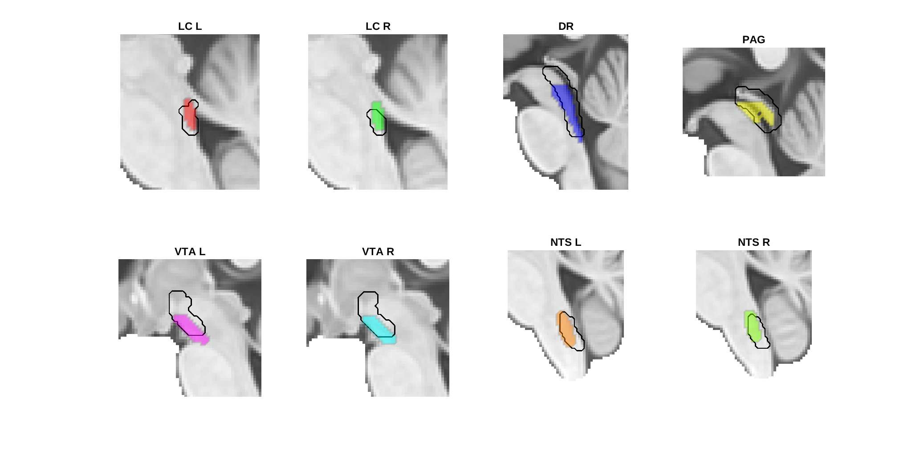

## Overview

A brainstem atlas of regions supporting limbic brain function. Open license and probablistic, based on 200+ participants 
from the HCP study. Five regions (Locus Coeruleus, Ventral Tegmental Area, Periaqueductal Gray, Nucleus Tractus Solitarius,
Dorsal Raphe) were manually segmented based on anatomical landmarks from "structural MRI scans" (T1w and T2w but possibly
also DWI images). A neurosurgeon and neuroradiologist evaluated each participant's mask to ensure it was within their
"tolerance". The people drawing the masks spent between 30 and 60 minutes per mask, so they were careful, but at the end
of the day they were working with invivo contrast images, and not anything that's particularly tuned to identifying the
cytoarchitectonic characteristics of these regions. For comparison, Bianciardi used T1-TSE imaging to delineate locus 
coruleus, which produces high contrast in cholinergic areas, but does not have an open license (distribution restrictions).

## Template Spaces

The original paper uses the HCP acpc_dc2standard transformation matrices to project individual participants into template
space but also uses the MNI152NLin2009bAsym 0.5mm template as a reference. The reference determines things like the origin
and sampling resolution. It isn't appropriate for the acpc_dc2standard transforms in my (BP's) opinion because HCP aligns 
their data to essentially the MNI152NLin6Asym template, not the MNi152NLin2009* templates. The most important feature that
distinguishes these templates in the context of brainstem region is their radii, which is larger for MNI152NLin2009cAsym.

To verify the impact of using the inappropriate reference image when applying these transforms I applied the acpc_dc2standard
transforms to acpc_dc-space T1w data from HCP using both MNI152NLin2009bAsym 0.5mm T1 and MNi152NLin6Asym 1mm T1 templates
as references. The results when viewed in connectome workbench were identical except for the sampling resolution, which was
higher in the case of the 0.5mm template. The original data is sampled at 1mm, so upsampling to 0.5mm is unlikely to achive
much. Consequently, I treat the atlas regions here as having been drawn in MNI152NLin6Asym space.

Data was transformed from MNI152NLin6Asym space to MNI152NLin2009cAsym space using the subcortically weighted transformations
provided by templates/transforms/ants/MNI152NLin6Asym_to_MNI152NLin2009cAsym_subctx.h5.

## Comparison with Bianciardi

Bianciard provides a better standard for segmenting some of these nuclei, especially cholinergic ones since they use T1-TSE
contrast instead of traditional T1w contrast. However the atlas does not have an open license (distribution restrictions).
Consequently this atlas may be preferable for some uses, but a comparison with Bianciardi is also important for evaluating
whether or not you prefer these regions to Biancairdi's.

Bianciardi's regions don't correspond to the Levinson Bari atlas perfectly, but the following mapping captures the
equivalence relationship:

Levinson-Bari -> Bianciardi 
LC -> LC 
DR -> DR_B7 
PAG -> PAG 
VTA -> VTA_PBP 
NTS -> VSM (partial, VSM is sensory and motor, while NTS should just be sensory) 

Colored Patches - Levinson Bari Limbic Brainstem Atlas 
Outlines - Bianciardi equivalents

Saggital

Coronal

Axial

## External Links

* https://www.uclahealth.org/departments/neurosurgery/research/research-grant-funding/surgical-neuromodulation-and-brain-mapping-lab/research-areas
* https://drive.google.com/drive/folders/1aC1wDXdrn848xLiHnAf0fqquYiXVDLLC

## References 

* Levinson S, Miller M, Iftekhar A, Justo M, Arriola D, Wei W, Hazany S, Avecillas-Chasin J, Kuhn T, Horn A, Bari A. (2023). A structural connectivity atlas of limbic brainstem nuclei. Frontiers in Neuroimaging.
